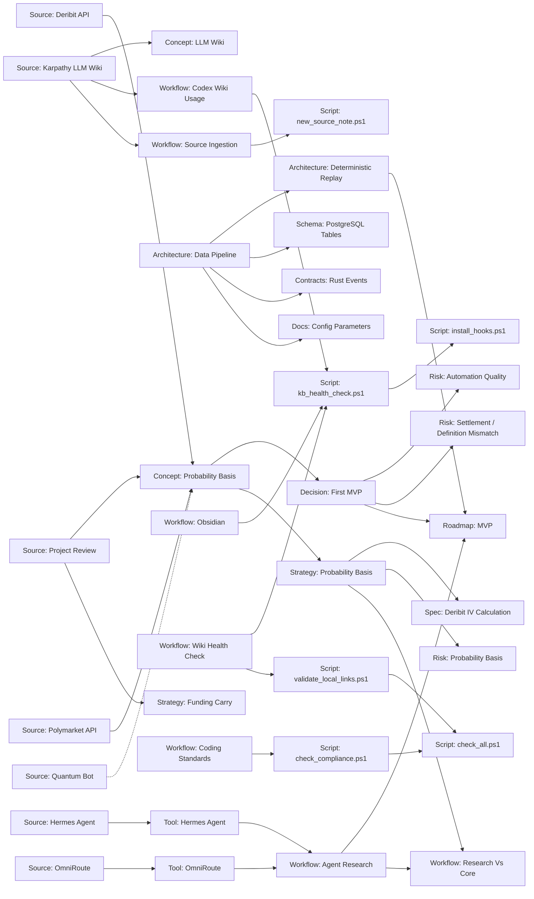

# Граф Базы Знаний

Эта страница содержит curated Mermaid-граф ключевых смысловых связей. Он не генерируется автоматически из всех Markdown-ссылок, потому что полный link graph быстро станет шумным.

Граф должен оставаться маленьким и показывать только важные связи:

- source -> concept,
- concept -> decision,
- decision -> risk,
- workflow -> automation script.

## Правило Поддержки

Codex обновляет этот граф только при появлении важных новых связей. Не нужно добавлять сюда каждую Markdown-ссылку.

При добавлении новой `decision` или `risk` страницы Codex обязан явно проверить, нужно ли добавить ее в этот граф. Если важной смысловой связи нет, граф можно не менять, но это решение должно быть осознанным.
